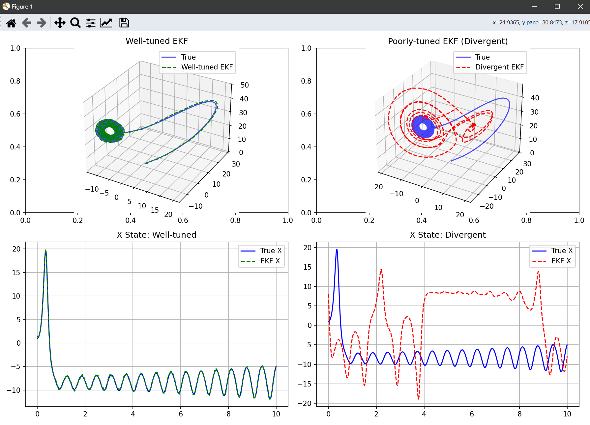
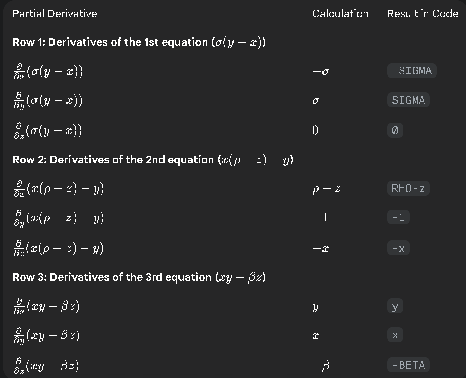

# Extended Kalman Filter for Lorenz Attractor

[](https://python.org)
[](https://numpy.org)
[](https://scipy.org)
[](https://matplotlib.org)
[](LICENSE)

A comprehensive demonstration of Extended Kalman Filter (EKF) performance on chaotic systems, showcasing the critical importance of proper filter tuning and the challenges that motivate advanced paradigms like EKF-EM.

## 🎯 Overview

This project implements an Extended Kalman Filter for the 3D Lorenz attractor system, demonstrating:

- **Filter Sensitivity**: How EKF performance depends critically on parameter tuning
- **Divergence Phenomena**: What happens when filters are poorly configured
- **Chaotic System Challenges**: Why nonlinear, chaotic systems are particularly difficult for state estimation
- **EKF-EM Motivation**: The fundamental problems that adaptive tuning methods solve

## 🚀 Features

- **Complete EKF Implementation**: Full prediction and update steps with Jacobian linearization
- **Lorenz System Dynamics**: Standard chaotic attractor with σ=10, ρ=28, β=8/3
- **Tuning Comparison**: Side-by-side visualization of well-tuned vs poorly-tuned filters
- **Performance Metrics**: RMSE calculation and covariance trace monitoring
- **3D Visualization**: Interactive trajectory plots in state space
- **Time Series Analysis**: Detailed temporal evolution of state estimates

## 📊 Results

### Well-tuned vs Poorly-tuned EKF Comparison



The visualization demonstrates:

**Top Row - 3D State Space Trajectories:**
- **Left (Green)**: Well-tuned EKF closely tracking the true Lorenz trajectory
- **Right (Red)**: Poorly-tuned EKF diverging significantly from the true path

**Bottom Row - Time Series Analysis:**
- **Left**: Excellent tracking performance with proper tuning
- **Right**: Clear divergence and incorrect oscillation patterns

### Mathematical Foundation

**Lorenz System Equations:**
```
dx/dt = σ(y - x)
dy/dt = x(ρ - z) - y  
dz/dt = xy - βz
```

**EKF Jacobian:**


The Jacobian matrix enables linearization of the nonlinear Lorenz dynamics for covariance propagation in the EKF prediction step.

## 🛠️ Installation

### Prerequisites

Ensure you have Python 3.8+ installed, then install required dependencies:

```bash
pip install -r requirements.txt
```

### Dependencies

- `numpy >= 1.19.0`
- `matplotlib >= 3.3.0`
- `scipy >= 1.5.0`

## 💻 Usage

### Basic Execution

Run the main demonstration:

```bash
python demo.py
```

This will:
1. Generate a true Lorenz trajectory
2. Run both well-tuned and poorly-tuned EKF scenarios
3. Display comparative visualizations
4. Print performance metrics

### Key Parameters

**Well-tuned Configuration:**
```python
x0 = [1.2, 1.2, 1.2]    # Close initial guess
P0 = np.eye(3) * 1.0     # Reasonable uncertainty
Q = np.eye(3) * 0.1      # Balanced process noise
```

**Poorly-tuned Configuration:**
```python
x0 = [10.0, -10.0, 50.0]  # Poor initial guess
P0 = np.eye(3) * 0.001    # Overconfident
Q = np.eye(3) * 1e-6      # Insufficient process noise
```

## 📈 Performance Analysis

### Typical Results

**Well-tuned EKF:**
- RMSE: ~0.5-1.0
- Stable covariance trace
- Excellent trajectory tracking

**Poorly-tuned EKF:**
- RMSE: >5.0
- Exponentially growing covariance
- Complete divergence from true trajectory

### Divergence Detection

The code includes automatic divergence detection:

```python
if np.trace(ekf.P) > 1000:
    print(f"Filter diverged at step {i}!")
    break
```

## 🔬 Technical Details

### EKF Implementation

The Extended Kalman Filter consists of two main steps:

**Prediction Step:**
1. Nonlinear state propagation using Euler integration
2. Linear covariance propagation using Jacobian matrix

**Update Step:**
1. Innovation calculation based on measurement residual
2. Kalman gain computation
3. State and covariance updates

### Lorenz System Characteristics

- **Chaotic Behavior**: Sensitive dependence on initial conditions
- **Strange Attractor**: Bounded but non-periodic trajectories  
- **Lyapunov Exponents**: Positive leading exponent indicates chaos
- **Dimension**: 3D continuous-time system

**The Problem:**
- Manual Q-R matrix tuning is trial-and-error
- Poor tuning leads to filter divergence
- No systematic method for parameter optimization

**The EKF-EM Solution:**
- Adaptive Q matrix tuning based on innovation analysis
- Robustness and sensitivity metrics for automatic adjustment
- Systematic approach eliminating manual parameter selection

## 📁 Project Structure

```
├── images/
│   ├── jacobian_derivation.png      # Mathematical derivations
│   ├── lorenz_equation.png      # System equations
│   └── output.png               # Comparison results
├── demo.py                      # Main demonstration script
├── README.md                    # This file
├── requirements.txt             # Python dependencies
└── LICENSE                      # MIT License
```

## 📄 License

This project is licensed under the MIT License - see the [LICENSE](LICENSE) file for details.

## 📚 References

1. Saha, M., & Ghosh, R. (2024). "Tuning the EKF using estimated measurements (EKF-EM) for balanced performances." Measurement, 236, 115017.
https://www.sciencedirect.com/science/article/abs/pii/S0263224124010017

## ⚡ Quick Start

```bash
# Clone repository
git clone https://github.com/realyashagarwal/lorenz-ekf-demonstration
cd ekf-lorenz-demo

# Install dependencies  
pip install -r requirements.txt

# Run demonstration
python demo.py
```

---

*This project demonstrates the fundamental challenges in nonlinear state estimation and motivates the need for adaptive filtering paradigms.*